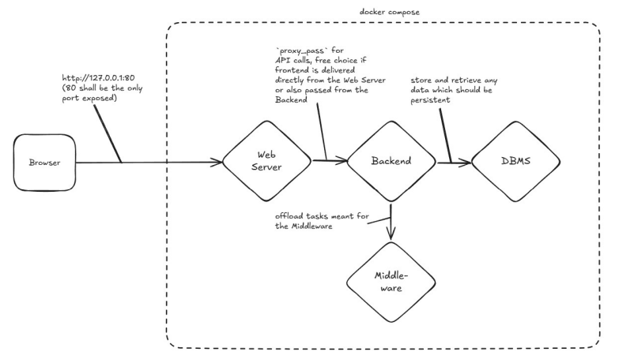

# request-rate-test

This is my test project for “Request Info & Rate Limit”.

## Features
1. **Webserver (NGINX)** Delivers static content (HTML/CSS/JS) and forwards all calls with `/api/data` an das **Backend** weiter.
2. **Backend (Python + Flask)** Takes request, and calls the **Middleware** for (example)Categorization and safe data in db > (PostgreSQL).
3. **Middleware (Python + Flask)** Performs a simple text categorization (in this example).
4. **DBMS (PostgreSQL)** Safe the incoming data.

## Use
- install: docker, python(lts version), flask (pip install flask)
- start your docker engine first, than run: **docker-compose up --build**

## Example

